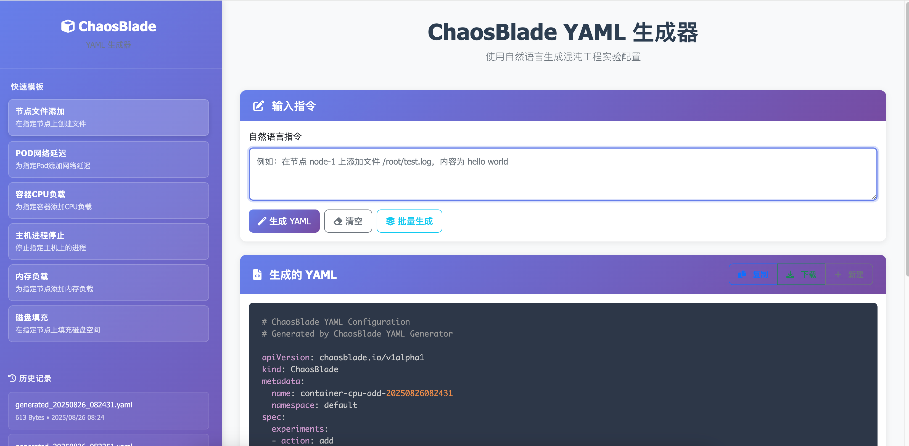

# ChaosBlade YAML生成故障注入

### 显示效果

<p align="center">

</p>

### 使用配置
```bash
配置 config.py中的大模型 LLM_BASE_URL和Authorization，如果自己大模型没有配置Authorization，就不需要配置
```

## 基本命令

### 1. 直接生成 YAML
```bash
python chat.py "自然语言描述"
```

### 2. 交互式模式
```bash
python chat.py --interactive
# 或
python chat.py -i
```

### 3. 批量测试
```bash
python chat.py --test
```

## 快速示例

### Node 作用域
```bash
# 文件操作
python chat.py "在节点 node-1 上添加文件 /root/test.log，内容为 hello world"

# 网络实验
python chat.py "在节点 node-1 上创建网络延迟，延迟 3000ms，网卡 eth0"

# CPU 负载
python chat.py "在节点 node-1 上创建 CPU 负载，负载 90%，使用 CPU 0-3"
```

### Pod 作用域
```bash
# 文件操作
python3 chat.py "在 Pod nginx-pod-12345 中添加文件 /app/test.log，内容为 test content"

# 网络实验
python3 chat.py "在 Pod web-app-pod 上创建网络延迟，延迟 100ms"

# 进程控制
python chat.py "在 Pod app-pod 中杀死 nginx 进程，使用信号 9"
```

### Container 作用域
```bash
# 文件操作
python chat.py "在容器 app-container 中添加文件 /root/test.sh，启用 Base64 编码"

# 资源负载
python chat.py "在容器 web-container 中创建 CPU 负载，负载 60%，核心数 2"
```

### Host 作用域

```bash
# 文件操作
python chat.py "在主机 192.168.1.100 上创建文件 /tmp/host-test.log"

# 系统服务
python chat.py "在主机 server-01 上停止 nginx 服务"
```

### CRI 作用域

```bash
# 容器控制
python chat.py "暂停容器 container-id-12345，运行时为 docker"
```

## 常用参数模式

### 文件操作
- 基本格式: `在[目标]上添加文件[路径]，内容为[内容]`
- 示例: `在节点 node-1 上添加文件 /root/test.log，内容为 hello world`

### 网络实验
- 延迟: `创建网络延迟，延迟[时间]ms，网卡[网卡名]`
- 丢包: `创建网络丢包，丢包率[百分比]%`
- 示例: `在节点 node-1 上创建网络延迟，延迟 3000ms，网卡 eth0`

### CPU 负载
- 基本格式: `创建 CPU 负载，负载[百分比]%，使用 CPU[核心范围]`
- 示例: `在节点 node-1 上创建 CPU 负载，负载 90%，使用 CPU 0-3`

### 进程控制
- 终止: `杀死[进程名]进程，使用信号[信号号]`
- 示例: `在 Pod app-pod 中杀死 nginx 进程，使用信号 9`


## 🚀 一键启动

### 方式一：Python快速启动（推荐）

```bash
# 启动Web界面（默认）
python3 quick_start.py

# 启动命令行模式
python3 quick_start.py --cli

# 只检查环境
python3 quick_start.py --check
```

### 方式二：Shell脚本启动（Linux/Mac）

```bash
# 完整启动流程
./start.sh

# 只检查环境
./start.sh --check

# 只安装依赖
./start.sh --install

# 启动CLI模式
./start.sh --cli
```

### 方式三：批处理启动（Windows）

```cmd
REM 完整启动流程
start.bat

REM 只检查环境
start.bat --check

REM 启动CLI模式
start.bat --cli
```

### 方式四：手动启动

```bash
# 1. 激活虚拟环境
source .venv/bin/activate  # Linux/Mac
# 或
.venv\Scripts\activate.bat  # Windows

# 2. 安装依赖
pip3 install -r requirements.txt

# 3. 启动Web服务
python3 web_app.py

# 或启动CLI模式
python3 chat.py --interactive
```

## 📱 访问方式

启动成功后：
- **Web界面**: http://localhost:5001 (端口可能自动调整)
- **API接口**: http://localhost:5001/api/
- **健康检查**: http://localhost:5001/api/health

## 🎯 多模型支持

现已支持15个主流AI模型：

| 模型 | 标识 | 特性 | 配置状态 |
|------|------|------|----------|
| DeepSeek R1 | `deepseek-r1` | 推理能力强 | ⚠️ 需配置 |
| DeepSeek V3 | `deepseek-v3` | 综合能力强 | ⚠️ 需配置 |
| GPT-4.1 Mini | `gpt-4.1-mini` | 快速响应 | ⚠️ 需配置 |
| GPT-4.1 Nano | `gpt-4.1-nano` | 轻量级 | ⚠️ 需配置 |
| GPT-5 | `gpt-5` | 最新模型 | ⚠️ 需配置 |
| GPT-4o Mini | `gpt-4o-mini` | 优化版本 | ⚠️ 需配置 |
| Gemini 2.0 Flash | `gemini-2.0-flash` | 图像生成 | ⚠️ 需配置 |
| Gemini 2.5 Flash | `gemini-2.5-flash` | 多模态快速 | ⚠️ 需配置 |
| Gemini 2.5 Pro | `gemini-2.5-pro` | 多模态专业 | ⚠️ 需配置 |
| GLM 4.5 | `glm-4.5` | 智谱AI | ⚠️ 需配置 |
| Kimi K2 | `kimi-k2` | 长文本处理 | ⚠️ 需配置 |
| Qwen3 Coder | `qwen3-coder` | 代码生成 | ⚠️ 需配置 |
| Qwen3 Coder 480B | `qwen3-coder-480b` | 大规模代码 | ⚠️ 需配置 |
| Llama3.1 | `llama3.1` | 开源模型 | ✅ 已配置 |

## ⚙️ 模型配置

**第一次使用需要配置API密钥！** 

1. **查看配置指南**：

```bash
cat MODEL_CONFIG_GUIDE.md
```

2. **编辑配置文件**：

```bash
nano config.py
```

3. **填入API密钥**：

```python
MODEL_API_CONFIGS = {
   "deepseek-r1": {
       "api_key": "sk-your-deepseek-key-here"  # 填入你的密钥
   },
   # ... 其他模型配置
}
```

4. **重启应用**：

```bash
python3 quick_start.py
```

**支持的API服务商**：
- 🔥 DeepSeek API
- 🤖 OpenAI API  
- 🌟 Google AI Studio
- 🚀 Moonshot AI (Kimi)
- ☁️ 阿里云百炼 (通义千问)
- 🧠 智谱AI (GLM)
- 🦙 Ollama (预配置)

### API调用示例

```bash
curl -X POST http://localhost:5001/api/generate \
  -H "Content-Type: application/json" \
  -d '{
    "instruction": "在节点 node-1 上添加文件 /root/test.log，内容为 hello world",
    "model": "deepseek-r1"
  }'
```

### 获取模型列表

```bash
curl http://localhost:5001/api/models
```

## 🛠️ 开发建议

* 确保目标资源存在且可访问
* 设置合理的超时时间
* 生产环境建议启用安全模式
* 避免在控制平面节点上执行实验
* 监控节点资源使用情况
* 确保有足够的节点副本
* 检查文件路径权限
* 考虑磁盘空间使用
* 确保文件操作可回滚


